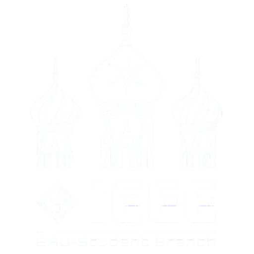

<div align="center">
  
  
  # IEEE ERU Student Branch | Official Terminal
  **Empowering the next generation of engineers and innovators at Egyptian Russian University.**

  <p align="center">
    
    
    
    
    
  </p>
</div>

## 🌌 Overview
Welcome to the Official Terminal for the **IEEE ERU Student Branch**. This digital headquarters is designed specifically to inspire, guide, and connect aspiring engineers, developers, and tech-enthusiasts. Crafted with an immersive "Cyber/Tactical" aesthetic, this highly-interactive platform serves as the central hub for our community operations, elite member showcases, and mission briefings.

## ✨ Key Capabilities

🚀 **Immersive Cyber Experience:**
A distinct, tactical-themed interface built using cutting-edge CSS designs and `framer-motion` to provide smooth, high-octane page transitions and micro-interactions.

👥 **Elite Operative Showcase (Best Members):**
A beautifully crafted continuous scrolling carousel to recognize and feature our top-performing members across different committees.

🗓️ **Mission Briefings (Events Platform):**
Our dynamic event board showcases past archives and upcoming operations (events), providing detailed technical reports and image galleries natively within the grid. 

📡 **Real-time Navigation & Smooth Scroll:**
Advanced routing utilizing React Router DOM with an intelligent automated scroll-to-top architecture. Exploring the terminal is instantaneous and flawless.

💼 **Recruitment Portal (Join Us):**
A fully responsive, user-friendly interface for onboarding new recruits, supporting dynamic roles, document (CV) uploads, and academic info routing. 

## 🛠️ Tech Architecture

This project was built leveraging modern web development standards and optimized for performance:
- **Frontend Framework:** React.js (Bootstrapped with Vite for instant server start & HMR)
- **Styling:** Tailwind CSS (For utility-first, rapid, and responsive styling)
- **Animations:** Framer Motion (Orchestrating complex layout animations)
- **Icons:** Lucide-React (Crisp, tactical, fast-loading SVG icons)
- **Database/Backend & Storage:** Supabase (PostgreSQL operations & Storage Buckets)

## 📂 Quick Start & Operation

To deploy the terminal on your local machine, follow these directives:

### 1. Clone the Repository
```bash
git clone https://github.com/Ali-Abdelnaser/IEEE-ERU-Website.git
cd IEEE-ERU-Website
```

### 2. Install Dependencies
```bash
npm install
```

### 3. Setup Environment Variables
Create a `.env` file in the root directory and synchronize it with your database credentials:
```env
VITE_SUPABASE_URL=your_supabase_project_url
VITE_SUPABASE_ANON_KEY=your_supabase_anon_key
```

### 4. Initialize Local Server
```bash
npm run dev
```

Navigate to `http://localhost:5173/` in your browser to access the live terminal. 

## 📜 Legal & Identity 
Designed and maintained by the Technical Team at **IEEE ERU Student Branch**.

> *"Building the Next Generation of Innovators."*
